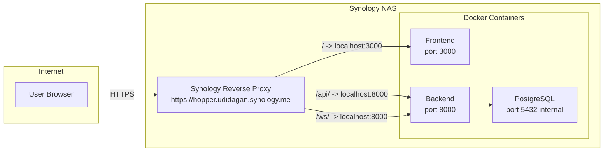
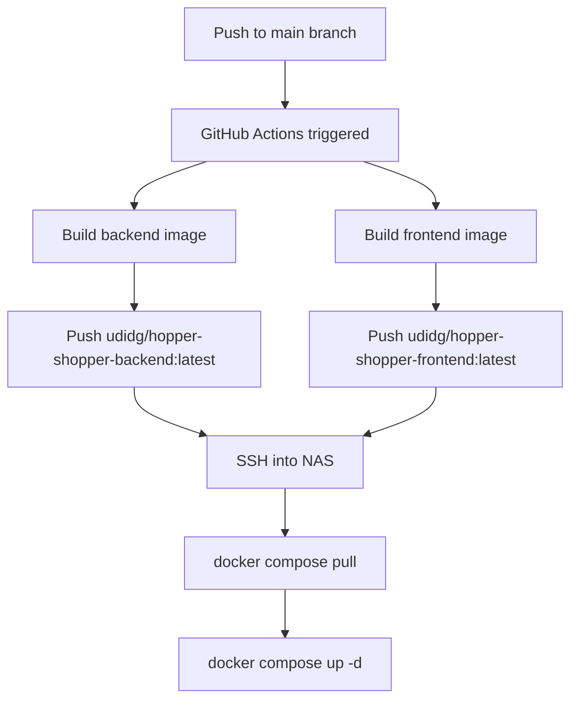
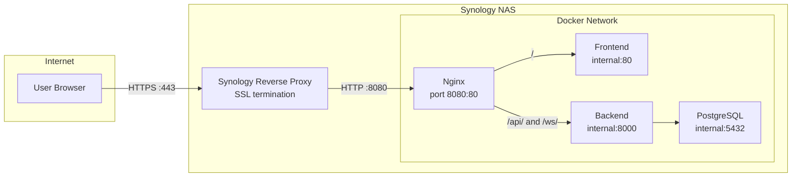

# Hopper Shopper – Deployment Plan

## Overview

Deploy the Hopper Shopper application to a Synology NAS via Docker, with images hosted on Docker Hub and source code on GitHub. Synology's built-in reverse proxy handles SSL termination and routing.

## Architecture



## CI/CD Flow



## Detailed Steps

### 1. Prepare Production Docker Compose

Create [`docker-compose.prod.yml`](docker-compose.prod.yml) that:
- **Removes** the nginx service entirely
- **References Docker Hub images** instead of local builds: `udidg/hopper-shopper-backend:latest` and `udidg/hopper-shopper-frontend:latest`
- **Exposes** backend on port `8000` and frontend on port `3000` to the host
- Keeps PostgreSQL internal-only (no host port exposure)
- Uses a named volume for persistent DB data

### 2. Update Backend Dockerfile for Production

Create [`backend/Dockerfile.prod`](backend/Dockerfile.prod) that:
- Removes `--reload` flag from uvicorn (not suitable for production)
- Uses a production-ready CMD

### 3. Update Frontend Dockerfile

The existing [`frontend/Dockerfile`](frontend/Dockerfile) is already production-ready (multi-stage build with nginx serving static files). The internal nginx listens on port 80; we'll map it to host port 3000 in docker-compose.

### 4. GitHub Actions CI/CD

Create [`.github/workflows/deploy.yml`](.github/workflows/deploy.yml) that:
- Triggers on push to `main` branch
- Builds both Docker images (multi-platform: `linux/amd64`)
- Pushes to Docker Hub as `udidg/hopper-shopper-backend` and `udidg/hopper-shopper-frontend`
- Optionally SSHs into the NAS to pull and restart containers

**Required GitHub Secrets:**
| Secret | Description |
|--------|-------------|
| `DOCKERHUB_USERNAME` | `udidg` |
| `DOCKERHUB_TOKEN` | Docker Hub access token |
| `NAS_HOST` | `hopper.udidagan.synology.me` or NAS IP |
| `NAS_USER` | SSH username on the NAS |
| `NAS_SSH_KEY` | Private SSH key for NAS access |
| `NAS_DEPLOY_PATH` | Path on NAS where docker-compose.prod.yml lives |

### 5. Production Environment File

Create [`.env.production.example`](.env.production.example) with NAS-specific defaults:
- `DATABASE_URL` pointing to the `db` service
- `CORS_ORIGINS` set to `https://hopper.udidagan.synology.me`
- `DOMAIN` set to `hopper.udidagan.synology.me`

### 6. Push to GitHub

Steps to execute manually:
```bash
# Create the repo on GitHub (via CLI or web UI)
gh repo create udidg/hopper-shopper --public --source=. --remote=origin

# Push
git add .
git commit -m "Initial commit with deployment config"
git push -u origin main
```

### 7. Synology NAS Setup

#### 7a. SSH into NAS and prepare
```bash
# Create project directory
mkdir -p /volume1/docker/hopper-shopper
cd /volume1/docker/hopper-shopper

# Copy docker-compose.prod.yml and .env to this directory
```

#### 7b. Create `.env` file on NAS
Copy `.env.production.example` and fill in real values.

#### 7c. Start the stack
```bash
cd /volume1/docker/hopper-shopper
docker compose -f docker-compose.prod.yml up -d
```

#### 7d. Configure Synology Reverse Proxy

In DSM → **Control Panel → Login Portal → Advanced → Reverse Proxy**:

**Rule 1 – Frontend (catch-all):**
| Field | Value |
|-------|-------|
| Description | Hopper Shopper - Frontend |
| Source Protocol | HTTPS |
| Source Hostname | hopper.udidagan.synology.me |
| Source Port | 443 |
| Destination Protocol | HTTP |
| Destination Hostname | localhost |
| Destination Port | 3000 |

**Rule 2 – Backend API:**
| Field | Value |
|-------|-------|
| Description | Hopper Shopper - API |
| Source Protocol | HTTPS |
| Source Hostname | hopper.udidagan.synology.me |
| Source Port | 443 |
| Destination Protocol | HTTP |
| Destination Hostname | localhost |
| Destination Port | 8000 |
| Custom Header | Under Advanced Settings → Custom Header |

> **Important:** Rule 2 must be **above** Rule 1 in the list, and you need to add a path-based condition. Unfortunately, Synology's built-in reverse proxy does NOT support path-based routing natively.

#### 7e. Alternative: Use a single reverse proxy rule + keep nginx

Since Synology's reverse proxy doesn't support path-based routing well, the **recommended approach** is actually:

1. **Keep nginx in docker-compose** as the internal router (exposed on port `8080`)
2. Create **one** Synology reverse proxy rule: `https://hopper.udidagan.synology.me:443` → `http://localhost:8080`
3. Nginx handles `/api/` → backend, `/ws/` → backend, `/` → frontend

This is simpler and more reliable. The docker-compose.prod.yml will be updated to reflect this.

### 8. Revised Architecture with Nginx



## Files to Create/Modify

| File | Action | Description |
|------|--------|-------------|
| `docker-compose.prod.yml` | Create | Production compose with Docker Hub images + nginx |
| `backend/Dockerfile.prod` | Create | Production Dockerfile without --reload |
| `.github/workflows/deploy.yml` | Create | CI/CD pipeline |
| `.env.production.example` | Create | Production env template |
| `nginx/nginx.prod.conf` | Create | Production nginx config without SSL (Synology handles SSL) |
| `plans/nas-deployment-guide.md` | Create | Step-by-step NAS setup guide |

## Summary

The final setup will be:
1. **GitHub** hosts the source code at `udidg/hopper-shopper`
2. **GitHub Actions** builds and pushes images to Docker Hub on every push to `main`
3. **Docker Hub** hosts `udidg/hopper-shopper-backend` and `udidg/hopper-shopper-frontend`
4. **Synology NAS** runs the stack via `docker-compose.prod.yml`, pulling images from Docker Hub
5. **Synology Reverse Proxy** provides SSL and forwards to nginx on port 8080
6. **Nginx container** routes requests to frontend and backend services
