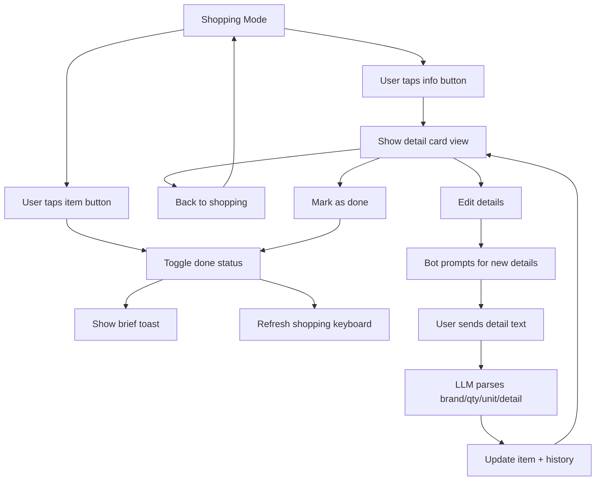

# Details UX Redesign Plan

## Problem Analysis

### Problem 1: Toggle = Detail (Conflated Actions)
Tapping an item in shopping mode does **two things**: toggles done status AND shows a detail toast. These are fundamentally different intents — "I bought this" vs "what brand should I get?" — but they're bound to the same tap. Users who just want to check details accidentally mark items as done.

### Problem 2: 200-char Alert Limitation
The detail popup uses Telegram's `show_alert=True` which caps at ~200 characters. For items with brand + quantity + description + price + who added + date, this truncates. The alert also looks like a system dialog, not a rich detail view.

### Problem 3: `/detail` Command is Unintuitive
`/detail תפוחי אדמה של דוד משה` requires users to know where the item name ends and the detail begins. The bot uses fuzzy matching against history, but it's fragile and confusing.

### Problem 4: Inconsistent Detail Display
Details appear differently across views:
- **Shopping buttons**: `☐ חלב · 1 ליטר [תנובה]` (inline, cluttered)
- **`/list`**: `☐ חלב (1 ליטר) [תנובה] — שרי` (mixed brackets/parens/dashes)
- **`/sort`**: `• חלב (1 ליטר) [תנובה] ₪7.90 — שרי` (even more cluttered)
- **Toggle toast**: `✅ חלב (תנובה · 1 ליטר · שרי · ₪7.90)` (yet another format)

---

## Solution

### Change 1: Two-Button Row in Shopping Mode

Replace the single full-width toggle button with a **two-button row**:

```
━━ 🧀 מוצרי חלב (1/3) ━━
[  ☐  חלב                    ] [ℹ️]
[  ☐  גבינה צהובה            ] [ℹ️]
[  ✅  יוגורט                 ] [ℹ️]
━━ 🥬 ירקות ופירות (0/2) ━━
[  ☐  עגבניות x2             ] [ℹ️]
[  ☐  מלפפונים               ] [ℹ️]
```

- **Left button** (wide, ~85% width): Toggle done — `shop:toggle:{id}` — same as today
- **Right button** (narrow, ~15%): View details — `shop:detail:{id}` — **no side effects**
- The toggle button shows only the item name + quantity hint (clean, scannable)
- Brand/description/price move to the detail view

This cleanly separates the two intents: **"I bought this"** vs **"tell me more about this"**.

### Change 2: Rich Detail View via Inline Message Edit

Instead of the 200-char `show_alert` popup, tapping ℹ️ **temporarily replaces** the shopping keyboard with a detail card, then provides a "← חזרה" (back) button to return:

```
📦 חלב

🏷️ תנובה
📏 1 ליטר
📝 3% שומן
🏬 מוצרי חלב
💰 ₪7.90
👤 נוסף ע"י: אודי
📅 29/03/2026 11:30

[← חזרה לרשימה] [✅ סמן כנקנה]
```

**Why this is better:**
- No character limit — full detail display
- Feels like a native "drill-down" navigation pattern
- The "back" button returns to the shopping keyboard exactly as it was
- Optional "mark as done" button right from the detail view
- Callback data: `shop:back:{list_id}` to rebuild the shopping keyboard

### Change 3: Replace `/detail` with Interactive Detail Editing

Instead of the unintuitive `/detail item_name detail_text` command, provide **two better entry points**:

#### A. From the ℹ️ detail view (shopping mode)
Add an "✏️ ערוך" (edit) button to the detail card. Tapping it sends a prompt:
```
✏️ שלחו פרטים חדשים עבור "חלב":
דוגמה: תנובה 3% 1 ליטר
```
The bot then waits for the next message from that user in that chat and parses it as detail updates (using the existing LLM update intent).

#### B. Keep `/detail` but with guided flow
If called without arguments (`/detail`), show the current list as inline buttons — user taps the item they want to edit, then gets the prompt above. If called with arguments, keep the existing behavior as a power-user shortcut.

### Change 4: Unified Detail Formatting

Create a single `format_item_detail()` function used everywhere:

```python
def format_item_detail(item: dict, style: str = "inline") -> str:
    """Format item details consistently.
    
    Styles:
      - "inline": compact, for button labels → "חלב x2"
      - "line": single line, for /list → "☐ חלב (2 ליטר, תנובה)"  
      - "card": multi-line, for detail view → full card with emojis
    """
```

| Context | Style | Example |
|---------|-------|---------|
| Shopping button label | `inline` | `חלב x2` |
| `/list` item line | `line` | `☐ חלב (2 ליטר, תנובה)` |
| `/sort` item line | `line` | `• חלב (2 ליטר, תנובה) ₪7.90` |
| Detail view | `card` | Full multi-line card with emojis |
| Toggle toast | `inline` | `✅ חלב (תנובה · 2 ליטר)` |

---

## Flow Diagram



---

## Files to Modify

| File | Changes |
|------|---------|
| [`bot/handlers/callbacks.py`](bot/handlers/callbacks.py) | Redesign `_build_shopping_keyboard()` for two-button rows; rewrite `_handle_detail_popup()` to use message edit instead of alert; add `shop:back` and `shop:edit` handlers; simplify `_build_toggle_toast()` |
| [`bot/services/formatter.py`](bot/services/formatter.py) | Add `format_item_detail()` with inline/line/card styles; refactor `format_sorted_list()` and `format_plain_list()` to use it |
| [`bot/handlers/commands.py`](bot/handlers/commands.py) | Refactor `detail_command()` to support guided flow (no-args shows item picker) |
| [`bot/handlers/messages.py`](bot/handlers/messages.py) | Refactor `_item_to_dict()` to use `format_item_detail()` |
| [`bot/main.py`](bot/main.py) | No changes needed — callbacks already routed |

## No Database Migration Needed

All fields already exist on [`GroceryItem`](bot/models/grocery_item.py:11) and [`ItemHistory`](bot/models/item_history.py).
