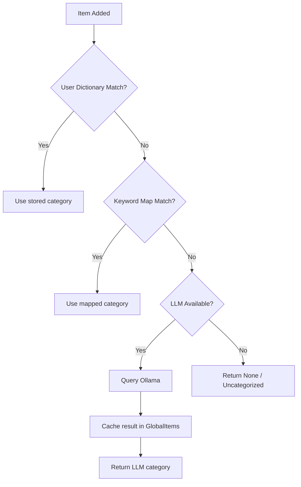

# Hopper Shopper – FE/BE Improvements Plan

## Overview

This plan covers five areas of improvement:
1. **FE**: Fix `+` button centering in the InputBar
2. **BE**: Support Hebrew items with language-aware category detection
3. **BE**: Support autocomplete from a global item dictionary
4. **BE**: Auto-suggest store departments (department autocomplete)
5. **BE**: Incorporate a small LLM (Ollama) for department classification

---

## 1. FE: Fix `+` Button Centering in InputBar

**Problem**: The `+` (send) button in [`InputBar.tsx`](frontend/src/components/InputBar.tsx:62) may not appear visually centered within its circular container.

**Root Cause**: The `.send-btn` CSS in [`telegram-theme.css`](frontend/src/styles/telegram-theme.css:184) uses `display: flex; align-items: center; justify-content: center` which should center the `+` text. The issue is likely that the `+` character glyph has inherent vertical offset in the font metrics (ascenders/descenders cause visual misalignment).

**Fix**:
- Add `line-height: 1` and a small `padding-bottom` adjustment to `.send-btn` to visually compensate for the font glyph offset
- Alternatively, replace the `+` text with an SVG icon for pixel-perfect centering

**Files to modify**:
- [`frontend/src/styles/telegram-theme.css`](frontend/src/styles/telegram-theme.css:184) – adjust `.send-btn` styles
- Optionally [`frontend/src/components/InputBar.tsx`](frontend/src/components/InputBar.tsx:62) – if switching to SVG icon

---

## 2. BE: Hebrew Item Support with Language Detection

**Problem**: The current [`guess_category()`](backend/app/services/grouping.py:118) only matches English keywords. Hebrew item names like "חלב" or "עגבנייה" get no category.

**Approach**:
- Add a `HEBREW_CATEGORY_MAP` dictionary mapping Hebrew keywords to Hebrew category names
- Add a `detect_language()` helper that checks if the item name contains Hebrew characters (Unicode range `\u0590-\u05FF`)
- When Hebrew is detected, search `HEBREW_CATEGORY_MAP`; otherwise search the existing English `CATEGORY_MAP`

**Hebrew Category Mapping** (examples):

| Hebrew Keyword | Category (Hebrew) |
|---|---|
| חלב, גבינה, יוגורט, חמאה, ביצה | מוצרי חלב |
| עגבנייה, מלפפון, בצל, תפוח, בננה, גזר, פלפל, אבוקדו, לימון, חסה | ירקות ופירות |
| עוף, בשר, דג, סלמון, הודו, נקניק | בשר ודגים |
| לחם, פיתה, בגט, חלה, לחמנייה | מאפים |
| קפוא, גלידה, פיצה | קפואים |
| מים, מיץ, קפה, תה, בירה, יין | משקאות |
| אורז, פסטה, קמח, סוכר, שמן, חומץ, רוטב, שימורים | מזווה |
| סבון, אקונומיקה, ספוג, נייר מגבת, שקית אשפה | ניקיון |
| שמפו, משחת שיניים, דאודורנט, נייר טואלט | טיפוח |
| חיתול, מזון תינוקות | תינוקות |
| מזון כלבים, מזון חתולים | חיות מחמד |
| חטיף, ביסלי, במבה, קרקר, עוגייה | חטיפים |

**Files to modify**:
- [`backend/app/services/grouping.py`](backend/app/services/grouping.py) – add `HEBREW_CATEGORY_MAP`, `detect_language()`, update `guess_category()`

---

## 3. BE: Global Item Dictionary for Autocomplete

**Problem**: Current autocomplete in [`suggestion.py`](backend/app/services/suggestion.py:9) only searches the user's own `ItemDictionary`. New users get no suggestions.

**Approach**:
- Create a new `GlobalItemDictionary` model – a read-only, pre-seeded table of common grocery items in both English and Hebrew
- Seed it with ~200-300 common items across all departments
- Update [`search_suggestions()`](backend/app/services/suggestion.py:9) to search both user dictionary AND global dictionary, with user entries ranked higher
- Add a new Alembic migration for the table + seed data

**New model** (`backend/app/models/global_item.py`):
```python
class GlobalItem(Base):
    __tablename__ = "global_items"
    id: int (PK)
    name: str (indexed)
    name_he: str | None (indexed)  # Hebrew name
    category: str | None
    category_he: str | None  # Hebrew category
```

**Files to create/modify**:
- `backend/app/models/global_item.py` – new model
- [`backend/app/models/__init__.py`](backend/app/models/__init__.py) – register model
- [`backend/app/services/suggestion.py`](backend/app/services/suggestion.py) – update search to include global items
- `backend/alembic/versions/xxxx_add_global_items.py` – migration + seed data

---

## 4. BE + FE: Department Autocomplete

**Problem**: Users must manually type category/department names. There is no autocomplete for the department field.

**Approach**:
- Add a new API endpoint `GET /api/departments?q=...` that returns matching department names
- Source departments from: hardcoded list + categories found in user's ItemDictionary + GlobalItem categories
- On the frontend, add a department autocomplete dropdown in the [`ItemDetailModal`](frontend/src/components/ItemDetailModal.tsx) category field
- Also use it in the InputBar flow when a suggestion is selected

**New endpoint** in `backend/app/routers/suggestions.py`:
```
GET /api/departments?q=<query>&lang=<en|he>
→ Returns: [{ "name": "Produce", "name_he": "ירקות ופירות" }]
```

**Files to create/modify**:
- [`backend/app/routers/suggestions.py`](backend/app/routers/suggestions.py) – add department endpoint
- `backend/app/services/department.py` – new service for department search
- [`frontend/src/components/ItemDetailModal.tsx`](frontend/src/components/ItemDetailModal.tsx) – add department autocomplete
- `frontend/src/hooks/useDepartments.ts` – new hook for department suggestions
- [`frontend/src/services/api.ts`](frontend/src/services/api.ts) – add `getDepartments()` API call
- [`frontend/src/types.ts`](frontend/src/types.ts) – add `Department` type

---

## 5. BE: Ollama LLM for Department Classification

**Problem**: The keyword-based `guess_category()` cannot handle items not in the predefined maps. An LLM can classify arbitrary item names into departments.

**Approach**:
- Add an Ollama container to `docker-compose.yml` running a small model (e.g., `gemma:2b` ~1.5GB RAM)
- Create an `LLMService` that sends a structured prompt to Ollama asking it to classify an item into a department
- Integrate as a fallback in the category guessing pipeline: User dictionary → Keyword map → LLM → None
- Cache LLM results in the global dictionary to avoid repeated calls

**Architecture**:



**Docker addition** in [`docker-compose.yml`](docker-compose.yml):
```yaml
ollama:
  image: ollama/ollama:latest
  volumes:
    - ollama_data:/root/.ollama
  expose:
    - "11434"
  restart: unless-stopped
  networks:
    - hopper-net
```

**LLM Prompt Strategy**:
```
Given a grocery item name, classify it into one of these store departments:
[list of departments in EN and HE]
Item: "{item_name}"
Respond with ONLY the department name.
```

**Files to create/modify**:
- [`docker-compose.yml`](docker-compose.yml) – add Ollama service + volume
- [`docker-compose.prod.yml`](docker-compose.prod.yml) – add Ollama service + volume
- `backend/app/services/llm.py` – new LLM service (HTTP calls to Ollama)
- [`backend/app/services/grouping.py`](backend/app/services/grouping.py) – integrate LLM fallback
- [`backend/app/config.py`](backend/app/config.py) – add `ollama_url` setting
- [`backend/requirements.txt`](backend/requirements.txt) – add `httpx` for async HTTP calls to Ollama
- [`.env.example`](.env.example) – add `OLLAMA_URL` variable

---

## Implementation Order

The work should be done in this sequence to minimize conflicts:

1. **FE: Fix button centering** – isolated CSS change, no dependencies
2. **BE: Hebrew keyword map + language detection** – extends existing `grouping.py`
3. **BE: Global item dictionary model + migration + seed data** – new table, no breaking changes
4. **BE: Update suggestion service** – search global items alongside user items
5. **BE: Department autocomplete endpoint** – new endpoint, depends on global items
6. **FE: Department autocomplete UI** – depends on department endpoint
7. **BE: Ollama Docker setup** – infrastructure change
8. **BE: LLM service + integration** – depends on Ollama container
9. **FE: Wire up LLM-powered suggestions** – final integration

---

## File Change Summary

| File | Action | Description |
|------|--------|-------------|
| `frontend/src/styles/telegram-theme.css` | Modify | Fix `.send-btn` centering |
| `frontend/src/components/InputBar.tsx` | Modify | Optionally use SVG icon |
| `backend/app/services/grouping.py` | Modify | Add Hebrew map, language detection, LLM fallback |
| `backend/app/models/global_item.py` | Create | GlobalItem model |
| `backend/app/models/__init__.py` | Modify | Register GlobalItem |
| `backend/app/services/suggestion.py` | Modify | Search global + user dictionaries |
| `backend/app/services/department.py` | Create | Department search service |
| `backend/app/services/llm.py` | Create | Ollama LLM integration |
| `backend/app/routers/suggestions.py` | Modify | Add department endpoint |
| `backend/app/config.py` | Modify | Add ollama_url setting |
| `backend/requirements.txt` | Modify | Add httpx |
| `docker-compose.yml` | Modify | Add Ollama service |
| `docker-compose.prod.yml` | Modify | Add Ollama service |
| `.env.example` | Modify | Add OLLAMA_URL |
| `backend/alembic/versions/xxxx_*.py` | Create | Migration for global_items |
| `frontend/src/components/ItemDetailModal.tsx` | Modify | Department autocomplete |
| `frontend/src/hooks/useDepartments.ts` | Create | Department suggestion hook |
| `frontend/src/services/api.ts` | Modify | Add getDepartments API |
| `frontend/src/types.ts` | Modify | Add Department type |
