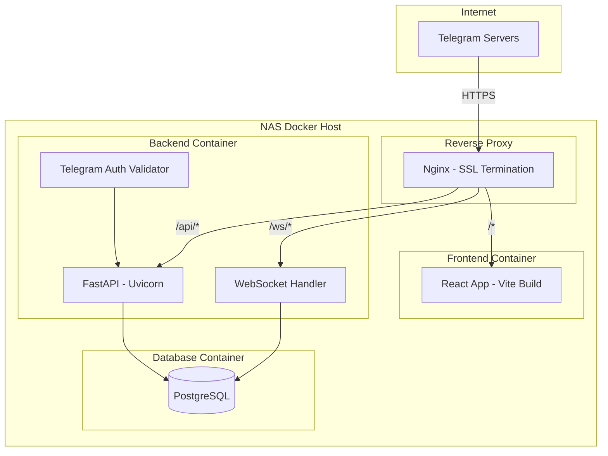
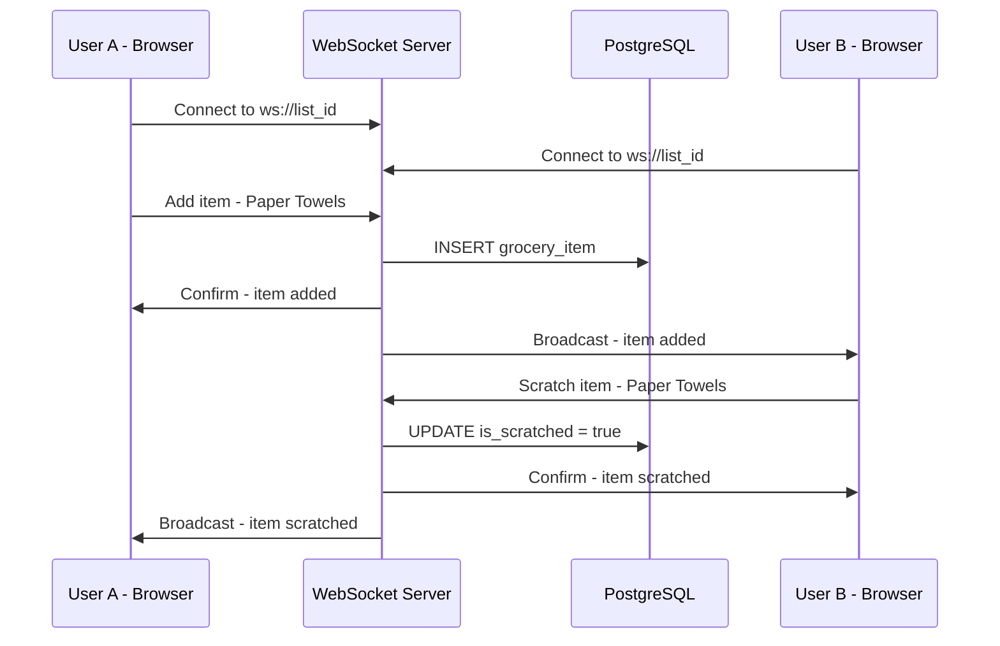

# Hopper Shopper - Implementation Plan

## Architecture Overview



## Data Flow - Real-Time Collaboration



## Project Structure

```
hopper-shopper/
├── docker-compose.yml
├── .env.example
├── nginx/
│   ├── nginx.conf
│   └── certs/              # SSL certs go here
├── backend/
│   ├── Dockerfile
│   ├── requirements.txt
│   ├── alembic.ini
│   ├── alembic/
│   │   ├── env.py
│   │   └── versions/
│   └── app/
│       ├── __init__.py
│       ├── main.py          # FastAPI app entry
│       ├── config.py        # Settings / env vars
│       ├── database.py      # Async engine + session
│       ├── models/
│       │   ├── __init__.py
│       │   ├── user.py
│       │   ├── grocery_list.py
│       │   ├── list_member.py
│       │   ├── item_dictionary.py
│       │   └── grocery_item.py
│       ├── schemas/          # Pydantic models
│       │   ├── __init__.py
│       │   ├── user.py
│       │   ├── grocery_list.py
│       │   └── grocery_item.py
│       ├── routers/
│       │   ├── __init__.py
│       │   ├── auth.py
│       │   ├── lists.py
│       │   ├── items.py
│       │   └── suggestions.py
│       ├── services/
│       │   ├── __init__.py
│       │   ├── auth.py       # Telegram initData validation
│       │   ├── suggestion.py # Auto-suggestion engine
│       │   └── grouping.py   # Auto-grouping logic
│       └── websocket/
│           ├── __init__.py
│           ├── manager.py    # Connection manager
│           └── handlers.py   # Message handlers
└── frontend/
    ├── Dockerfile
    ├── package.json
    ├── vite.config.ts
    ├── index.html
    ├── public/
    │   ├── manifest.json     # PWA manifest
    │   └── sw.js             # Service Worker
    └── src/
        ├── main.tsx
        ├── App.tsx
        ├── stores/
        │   ├── useListStore.ts    # Zustand store
        │   └── useAuthStore.ts
        ├── hooks/
        │   ├── useWebSocket.ts
        │   ├── useSuggestions.ts
        │   └── useOfflineSync.ts
        ├── components/
        │   ├── GroceryList.tsx     # Main grouped list
        │   ├── SectionGroup.tsx    # Sticky header group
        │   ├── GroceryItem.tsx     # Item with scratch
        │   ├── InputBar.tsx        # Bottom input + suggestions
        │   ├── SuggestionMenu.tsx  # Floating suggestions
        │   ├── ItemDetailModal.tsx # Edit drawer
        │   └── DragHandle.tsx      # Drag-and-drop handle
        ├── services/
        │   ├── api.ts             # REST API client
        │   ├── ws.ts              # WebSocket client
        │   └── offlineDb.ts       # Dexie.js setup
        └── styles/
            └── telegram-theme.css  # Telegram CSS vars
```

---

## Phase-by-Phase Implementation

### Phase 1: Project Scaffolding & Infrastructure
**What gets built:** Docker setup, project directory structure, configuration files.

**Files to create:**
- `docker-compose.yml` - All services: nginx, backend, frontend, postgres
- `.env.example` - All required environment variables
- `backend/Dockerfile` - Python 3.11, uvicorn
- `frontend/Dockerfile` - Node 20, multi-stage build with nginx
- `nginx/nginx.conf` - Reverse proxy config with SSL, WebSocket upgrade
- `backend/requirements.txt` - All Python dependencies
- `backend/app/config.py` - Pydantic Settings for env var management
- `backend/app/main.py` - FastAPI app skeleton with CORS

### Phase 2: Database Models & Migrations
**What gets built:** SQLAlchemy models, async database connection, Alembic setup.

**Files to create:**
- `backend/app/database.py` - Async engine, session factory, Base
- `backend/app/models/user.py` - User model (telegram_id, username, display_name)
- `backend/app/models/grocery_list.py` - GroceryList model (name, created_at, invite_code)
- `backend/app/models/list_member.py` - ListMember join table (user_id, list_id, role)
- `backend/app/models/item_dictionary.py` - ItemDictionary (name, default_category, last_price, preferred_store)
- `backend/app/models/grocery_item.py` - GroceryItem (name, category, description, is_scratched, sort_order)
- `backend/alembic.ini` + `backend/alembic/env.py` - Migration setup
- Initial migration via `alembic revision --autogenerate`

### Phase 3: Backend Core - Auth & List Management
**What gets built:** Telegram authentication, JWT tokens, list CRUD, invite system.

**Files to create:**
- `backend/app/services/auth.py` - Telegram initData hash validation, JWT creation
- `backend/app/routers/auth.py` - `POST /api/auth/telegram` endpoint
- `backend/app/schemas/user.py` - Pydantic request/response models
- `backend/app/schemas/grocery_list.py` - List schemas
- `backend/app/routers/lists.py` - `POST /api/lists`, `GET /api/lists/{id}`, `POST /api/lists/{id}/invite`, `POST /api/lists/join/{code}`
- `backend/app/dependencies.py` - Auth dependency (get_current_user from JWT)

### Phase 4: Backend - Items, Suggestions, Grouping, Sorting
**What gets built:** Full item CRUD, suggestion engine, auto-grouping, manual sort.

**Files to create:**
- `backend/app/schemas/grocery_item.py` - Item schemas
- `backend/app/routers/items.py` - `POST /api/lists/{id}/items`, `PATCH /api/items/{id}`, `DELETE /api/items/{id}`, `PUT /api/items/sort`
- `backend/app/routers/suggestions.py` - `GET /api/suggestions?q={query}`
- `backend/app/services/suggestion.py` - Fuzzy/partial match query against ItemDictionary
- `backend/app/services/grouping.py` - Category assignment logic with predefined map + dictionary lookup

### Phase 5: Backend - WebSocket Real-Time Collaboration
**What gets built:** WebSocket connection manager, message broadcasting per list.

**Files to create:**
- `backend/app/websocket/manager.py` - ConnectionManager class (connect, disconnect, broadcast per list_id)
- `backend/app/websocket/handlers.py` - Handle incoming WS messages (add_item, scratch_item, update_item, reorder)
- Wire WebSocket endpoint in `backend/app/main.py` at `/ws/{list_id}`

### Phase 6: Frontend Scaffolding
**What gets built:** Vite + React project, Telegram SDK integration, Zustand stores, API client.

**Files to create:**
- `frontend/package.json` - Dependencies: react, zustand, dnd-kit, dexie, axios
- `frontend/vite.config.ts` - Proxy config for dev
- `frontend/index.html` - Include Telegram Web App script
- `frontend/src/main.tsx` - App entry with Telegram SDK init
- `frontend/src/App.tsx` - Router/layout skeleton
- `frontend/src/stores/useAuthStore.ts` - Auth state (token, user)
- `frontend/src/stores/useListStore.ts` - List + items state
- `frontend/src/services/api.ts` - Axios instance with JWT interceptor
- `frontend/src/styles/telegram-theme.css` - CSS using Telegram theme variables

### Phase 7: Frontend - Main List View
**What gets built:** Grouped grocery list with sticky section headers.

**Files to create:**
- `frontend/src/components/GroceryList.tsx` - Groups items by category, renders SectionGroups
- `frontend/src/components/SectionGroup.tsx` - Sticky header + list of items in that section

### Phase 8: Frontend - Input Bar with Suggestions
**What gets built:** Bottom input field with floating auto-suggestion menu.

**Files to create:**
- `frontend/src/components/InputBar.tsx` - Fixed bottom input, debounced query
- `frontend/src/components/SuggestionMenu.tsx` - Floating menu above input showing matches
- `frontend/src/hooks/useSuggestions.ts` - Hook to fetch suggestions with debounce

### Phase 9: Frontend - Item Component & Edit Modal
**What gets built:** Item display with scratch, sub-text details, edit drawer.

**Files to create:**
- `frontend/src/components/GroceryItem.tsx` - Tap-to-scratch, strikethrough animation, sub-text
- `frontend/src/components/ItemDetailModal.tsx` - Drawer/modal for editing description, label, price, store

### Phase 10: Frontend - Drag-and-Drop
**What gets built:** Section reordering via drag-and-drop using dnd-kit.

**Files to update:**
- `frontend/src/components/GroceryList.tsx` - Wrap with DndContext
- `frontend/src/components/SectionGroup.tsx` - Make draggable
- `frontend/src/components/DragHandle.tsx` - Visual drag handle
- Persist new order to `PUT /api/items/sort`

### Phase 11: Frontend - WebSocket Integration
**What gets built:** Real-time sync between collaborating users.

**Files to create:**
- `frontend/src/services/ws.ts` - WebSocket client with reconnection logic
- `frontend/src/hooks/useWebSocket.ts` - Hook that connects to WS and dispatches Zustand actions

### Phase 12: Offline Support
**What gets built:** PWA manifest, service worker, IndexedDB caching, offline action queue.

**Files to create:**
- `frontend/public/manifest.json` - PWA manifest
- `frontend/public/sw.js` - Service worker for caching
- `frontend/src/services/offlineDb.ts` - Dexie.js schema and helpers
- `frontend/src/hooks/useOfflineSync.ts` - Queue offline actions, sync on reconnect

### Phase 13: Manual Steps - Telegram Bot & SSL Setup
> **These require your manual action:**

1. **Create a Telegram Bot:**
   - Open Telegram and message [@BotFather](https://t.me/BotFather)
   - Send `/newbot` and follow the prompts to create your bot
   - Copy the **Bot Token** and add it to your `.env` file as `TELEGRAM_BOT_TOKEN`

2. **Configure the Mini App:**
   - In BotFather, send `/mybots` → select your bot → **Bot Settings** → **Menu Button** or **Web App**
   - Set the Web App URL to your NAS domain (e.g., `https://hopper.yourdomain.com`)

3. **SSL Certificates:**
   - **Option A - Cloudflare Tunnel (recommended for NAS):** Install `cloudflared` on your NAS, create a tunnel pointing to your nginx container. This gives you a public HTTPS URL without port forwarding.
   - **Option B - Let's Encrypt:** If your NAS has a public domain, use certbot to generate certs and mount them into the nginx container.
   - **Option C - Self-signed (dev only):** Generate self-signed certs for local testing (Telegram won't accept these in production).

4. **DNS Configuration:**
   - Point your domain to your NAS IP (or use Cloudflare Tunnel for automatic DNS).

### Phase 14: Integration Testing & Deployment
**What gets verified:**
- Run `docker-compose up --build` and verify all services start
- Test Telegram auth flow end-to-end
- Test adding/scratching items with two users simultaneously
- Test suggestion engine with historical items
- Test drag-and-drop persistence
- Test offline mode: disconnect network, scratch items, reconnect and verify sync
- Verify SSL and Telegram Mini App loads correctly

---

## Dependency Graph

```mermaid
graph LR
    P1[Phase 1: Infrastructure] --> P2[Phase 2: DB Models]
    P2 --> P3[Phase 3: Auth + Lists API]
    P2 --> P4[Phase 4: Items + Suggestions API]
    P3 --> P5[Phase 5: WebSocket Backend]
    P4 --> P5
    P1 --> P6[Phase 6: Frontend Scaffold]
    P6 --> P7[Phase 7: List View]
    P6 --> P8[Phase 8: Input + Suggestions]
    P7 --> P9[Phase 9: Item + Edit Modal]
    P7 --> P10[Phase 10: Drag and Drop]
    P5 --> P11[Phase 11: WS Frontend]
    P9 --> P11
    P11 --> P12[Phase 12: Offline Support]
    P13[Phase 13: Manual - Bot + SSL] --> P14[Phase 14: Testing]
    P12 --> P14
