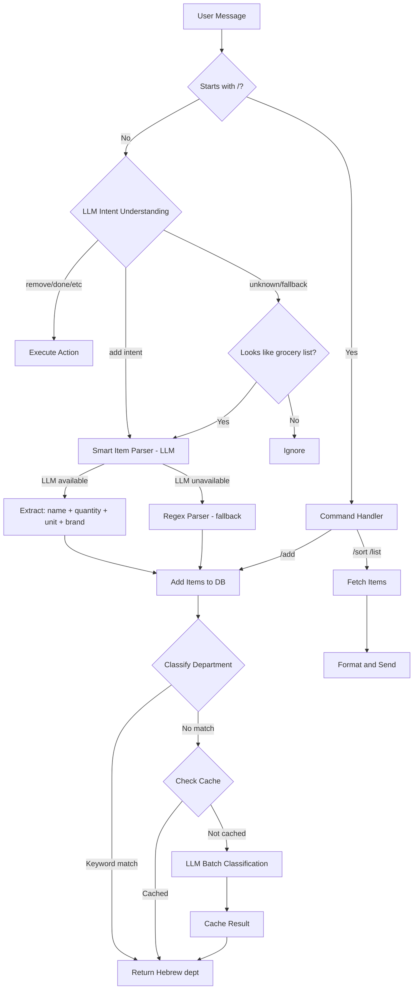

# LLM Improvement Plan — Hopper Shopper

## Current State

### Single LLM Usage Point
The LLM is used in **one place only**: `bot/services/llm.py:classify_department()` — classifying a grocery item into a supermarket department (e.g., "במבה" → "חטיפים").

**Model:** `gemma3:1b` via Ollama  
**Trigger:** Called as a fallback when keyword matching in `grouping.py` fails  
**Call chain:**
```
/add or free-text → list_manager.add_items() → grouping.guess_category_smart()
  → 1. keyword match (sync, fast)
  → 2. LLM fallback (async, slow) ← only LLM call
```

### Current Prompts

**System prompt:**
```
You are a grocery store department classifier for an Israeli supermarket.
Given a grocery item name (in Hebrew or English), classify it into exactly one of these store departments.

Hebrew departments: ירקות ופירות, מוצרי חלב, בשר ודגים, מאפים, קפואים, משקאות, חטיפים, מזווה, ניקיון, טיפוח, תינוקות, חיות מחמד

Rules:
- ALWAYS respond with the Hebrew department name, regardless of the input language.
- Respond with ONLY the department name, nothing else.
- Consider common Israeli grocery items and brands.
- If you cannot classify the item, respond with "אחר".
```

**User prompt:**
```
סווג את הפריט הבא למחלקה בסופרמרקט: "{item_name}"
```

**Parameters:** temperature=0.1, num_predict=50, timeout=15s

### Problems Identified

1. **Tiny model** — `gemma3:1b` struggles with Hebrew and nuanced classification
2. **No few-shot examples** — small models need examples to perform well
3. **Mixed languages in prompt** — system prompt in English, user prompt in Hebrew
4. **No batching** — each item = separate HTTP call to Ollama
5. **No caching** — same item classified repeatedly across sessions
6. **No structured output** — free-text response requires fragile parsing
7. **Single use case** — LLM only used for classification, not for parsing or understanding
8. **No graceful degradation feedback** — user doesn't know if LLM was used or not

---

## Improvement Plan

### 1. Improve Department Classification Prompt

**File:** `bot/services/llm.py`

Replace the current prompt with a few-shot, all-Hebrew prompt with structured output:

```python
_SYSTEM_PROMPT = """אתה מסווג מוצרים למחלקות בסופרמרקט ישראלי.

המחלקות האפשריות:
ירקות ופירות, מוצרי חלב, בשר ודגים, מאפים, קפואים, משקאות, חטיפים, מזווה, ניקיון, טיפוח, תינוקות, חיות מחמד

דוגמאות:
פריט: "אקטיביה תות" → מחלקה: "מוצרי חלב"
פריט: "שוקולד פרה" → מחלקה: "חטיפים"
פריט: "סבון כלים פיירי" → מחלקה: "ניקיון"
פריט: "קוסקוס אסם" → מחלקה: "מזווה"
פריט: "פרגיות טריות" → מחלקה: "בשר ודגים"
פריט: "בייגלה עגול" → מחלקה: "חטיפים"
פריט: "XL חיתולים" → מחלקה: "תינוקות"
פריט: "קולה זירו" → מחלקה: "משקאות"

ענה אך ורק בשם המחלקה, ללא הסבר נוסף.
אם אינך יודע, ענה: "אחר"
"""
```

**User prompt** (also Hebrew):
```python
user_prompt = f'פריט: "{item_name}" → מחלקה:'
```

**Key changes:**
- All-Hebrew prompt for consistency
- 8 few-shot examples covering diverse departments and Israeli brands
- Prompt format matches the few-shot pattern exactly
- Clearer fallback instruction

### 2. Add LLM-Based Smart Item Parsing

**New function in:** `bot/services/llm.py`

When a user sends free text like `"2 ק"ג עגבניות שרי, חלב תנובה 1 ליטר"`, the LLM should extract structured data:

```python
async def parse_items_smart(text: str) -> list[dict] | None:
    """
    Use LLM to parse free-text into structured grocery items.
    Returns list of {name, quantity, unit, brand} or None on failure.
    """
```

**Prompt:**
```
אתה עוזר לנתח רשימות קניות. חלץ מהטקסט את הפריטים כ-JSON.

דוגמה:
קלט: "2 קילו עגבניות שרי, חלב תנובה 1 ליטר, 6 ביצים"
פלט:
[
  {"name": "עגבניות שרי", "quantity": "2", "unit": "קילו", "brand": null},
  {"name": "חלב", "quantity": "1", "unit": "ליטר", "brand": "תנובה"},
  {"name": "ביצים", "quantity": "6", "unit": null, "brand": null}
]

ענה אך ורק ב-JSON תקין, ללא הסבר נוסף.
```

**Integration point:** `bot/handlers/messages.py:handle_text_message()` — before the current regex-based `parse_items_text()`, try the LLM parser first.

**Fallback:** If LLM is unavailable or fails, fall back to the existing regex parser.

### 3. Add Batch Classification

**New function in:** `bot/services/llm.py`

Instead of calling the LLM once per item, classify all unmatched items in a single call:

```python
async def classify_departments_batch(item_names: list[str]) -> dict[str, str | None]:
    """
    Classify multiple items in a single LLM call.
    Returns {item_name: department_name} mapping.
    """
```

**Prompt:**
```
סווג את הפריטים הבאים למחלקות בסופרמרקט ישראלי.

המחלקות: ירקות ופירות, מוצרי חלב, בשר ודגים, מאפים, קפואים, משקאות, חטיפים, מזווה, ניקיון, טיפוח, תינוקות, חיות מחמד

פריטים:
1. {item1}
2. {item2}
3. {item3}

ענה בפורמט JSON:
{"item1": "מחלקה", "item2": "מחלקה", ...}
```

**Integration point:** `bot/services/list_manager.py:add_items()` — collect all items that failed keyword matching, then classify them in one batch call.

### 4. Add LLM Result Caching

**New file:** `bot/services/llm_cache.py`

Cache LLM classification results to avoid repeated calls:

```python
# In-memory cache with TTL
_classification_cache: dict[str, tuple[str, float]] = {}
_CACHE_TTL = 86400  # 24 hours

async def cached_classify(item_name: str) -> str | None:
    """Classify with in-memory cache."""
    normalized = item_name.strip().lower()
    if normalized in _classification_cache:
        result, timestamp = _classification_cache[normalized]
        if time.time() - timestamp < _CACHE_TTL:
            return result
    
    result = await classify_department(item_name)
    if result:
        _classification_cache[normalized] = (result, time.time())
    return result
```

Also consider persisting cache to the `item_history` table — the `default_category` column already exists and can serve as a persistent cache.

### 5. Add Natural Language Command Understanding

**New function in:** `bot/services/llm.py`

Allow users to interact naturally without memorizing commands:

```python
async def understand_intent(text: str) -> dict | None:
    """
    Understand user intent from natural language.
    Returns {action, items, ...} or None.
    """
```

**Prompt:**
```
אתה עוזר לנהל רשימת קניות. נתח את כוונת המשתמש.

פעולות אפשריות: add, remove, done, list, sort, clear, help, unknown

דוגמאות:
"תוסיף חלב ולחם" → {"action": "add", "items": ["חלב", "לחם"]}
"תוריד את הביצים" → {"action": "remove", "items": ["ביצים"]}
"קניתי חלב" → {"action": "done", "items": ["חלב"]}
"מה ברשימה?" → {"action": "list", "items": []}
"תמיין לפי מחלקות" → {"action": "sort", "items": []}
"תנקה הכל" → {"action": "clear", "items": []}

ענה אך ורק ב-JSON תקין.
```

**Integration point:** `bot/handlers/messages.py:handle_text_message()` — when the message doesn't look like a grocery list AND doesn't start with `/`, try to understand the intent via LLM.

### 6. Upgrade Model and Make Configurable

**File:** `bot/config.py`

```python
ollama_model: str = "gemma3:4b"  # Upgrade default from 1b to 4b
```

The `gemma3:4b` model is significantly better at Hebrew and structured output while still being fast enough for real-time use on modest hardware.

### 7. Add Structured Output Parsing

**File:** `bot/services/llm.py`

Add a utility for reliable JSON extraction from LLM responses:

```python
import json
import re

def extract_json(text: str) -> dict | list | None:
    """Extract JSON from LLM response, handling markdown code blocks."""
    # Try direct parse
    text = text.strip()
    
    # Remove markdown code blocks if present
    md_match = re.search(r'```(?:json)?\s*([\s\S]*?)```', text)
    if md_match:
        text = md_match.group(1).strip()
    
    try:
        return json.loads(text)
    except json.JSONDecodeError:
        # Try to find JSON-like content
        for pattern in [r'\{[\s\S]*\}', r'\[[\s\S]*\]']:
            match = re.search(pattern, text)
            if match:
                try:
                    return json.loads(match.group())
                except json.JSONDecodeError:
                    continue
    return None
```

Use Ollama's `format: "json"` parameter when available to enforce JSON output.

---

## Architecture Diagram



## File Changes Summary

| File | Change Type | Description |
|------|------------|-------------|
| `bot/services/llm.py` | **Major rewrite** | Improved prompts, batch classification, smart parsing, intent understanding, JSON extraction |
| `bot/services/grouping.py` | **Modify** | Update `guess_category_smart` to use batch + cache |
| `bot/services/parser.py` | **Modify** | Add LLM-first parsing path with regex fallback |
| `bot/services/llm_cache.py` | **New file** | In-memory + DB-backed classification cache |
| `bot/handlers/messages.py` | **Modify** | Add intent understanding, smart parsing integration |
| `bot/services/list_manager.py` | **Modify** | Support structured items with quantity/unit/brand, batch classify |
| `bot/config.py` | **Modify** | Upgrade default model to `gemma3:4b` |
| `bot/models/grocery_item.py` | **Modify** | Add `quantity` and `unit` columns |
| `alembic/versions/003_*.py` | **New file** | Migration for new columns |

## Implementation Priority

1. **Improve classification prompt** — highest impact, smallest change
2. **Add JSON extraction utility** — needed by all new features
3. **Add result caching** — reduces LLM calls immediately
4. **Add batch classification** — reduces latency for multi-item adds
5. **Add smart item parsing** — extracts quantity/unit/brand
6. **Add natural language understanding** — most complex, biggest UX improvement
7. **Upgrade model** — simple config change, test after other improvements
