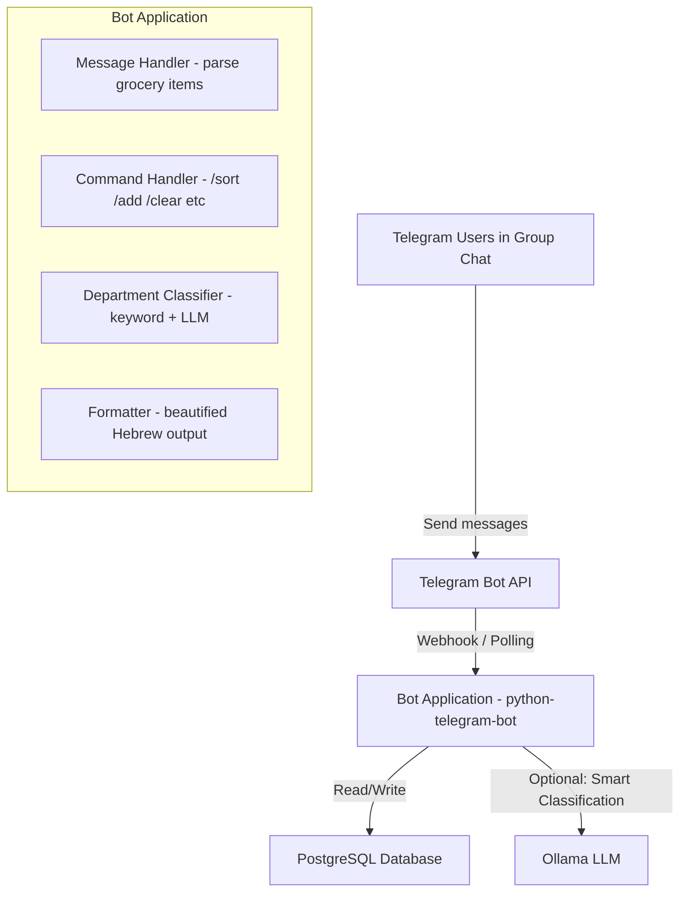
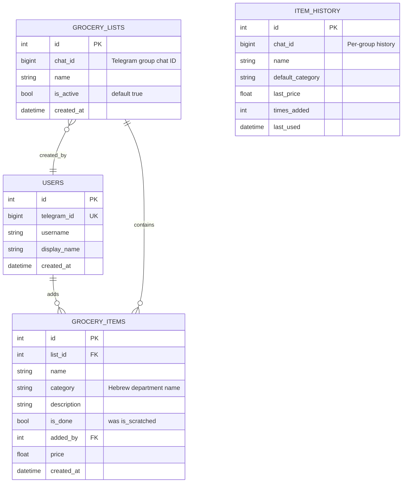

# Hopper Shopper — Telegram Bot Pivot Plan

## Overview

Pivot from a Telegram Mini App (React frontend + FastAPI backend) to a **pure Telegram Bot** with no dedicated frontend. The bot lives inside Telegram group chats, listens to grocery list messages, and responds with beautified, department-sorted lists — all in Hebrew.

---

## Architecture



---

## Core Flow

1. A user sends a grocery list message in a group chat (free-text, one item per line)
2. The bot parses each line into individual items
3. On `/sort` command, the bot classifies each item into a department using the existing keyword maps + optional LLM fallback
4. The bot replies with a beautified message sorted by department, in Hebrew

### Example Input
```
חלב
עגבניות
שניצל
לחם
אקונומיקה
במבה
```

### Example Output (after `/sort`)
```
🛒 רשימת קניות

🥬 ירקות ופירות
  • עגבניות

🧀 מוצרי חלב
  • חלב

🥩 בשר ודגים
  • שניצל

🍞 מאפים
  • לחם

🍿 חטיפים
  • במבה

🧹 ניקיון
  • אקונומיקה
```

---

## What We Keep from the Existing Codebase

| Component | Status | Notes |
|-----------|--------|-------|
| `backend/app/services/grouping.py` | **KEEP** | Core department classification logic, Hebrew/English keyword maps, `guess_category()`, `guess_category_smart()` |
| `backend/app/services/llm.py` | **KEEP** | Ollama LLM fallback for smart classification |
| `backend/app/config.py` | **MODIFY** | Keep `telegram_bot_token`, `database_url`, `ollama_url/model`. Remove JWT/CORS settings |
| `backend/app/models/` | **MODIFY** | Simplify — keep items/lists, adapt user model to not require Telegram Mini App auth |
| `backend/app/services/department.py` | **KEEP** | Department search utilities |
| `docker-compose.yml` | **MODIFY** | Remove frontend/nginx, keep db + bot + optional ollama |
| `frontend/` | **REMOVE** | Entire frontend directory — no longer needed |
| `nginx/` | **REMOVE** | No reverse proxy needed for a bot |
| `backend/app/routers/` | **REMOVE** | No REST API needed |
| `backend/app/websocket/` | **REMOVE** | No WebSocket needed |
| `backend/app/services/auth.py` | **REMOVE** | No Telegram initData validation needed |
| `backend/app/services/suggestion.py` | **KEEP** | Can be reused for inline query suggestions |

---

## Bot Commands & Features

### Core Commands

| Command | Description | Example |
|---------|-------------|---------|
| `/sort` | Sort the current list by department and send beautified message | Reply to a list message or use the stored list |
| `/add <items>` | Add items to the group's grocery list | `/add חלב, לחם, ביצים` |
| `/remove <item>` | Remove an item from the list | `/remove חלב` |
| `/clear` | Clear the entire list | `/clear` |
| `/list` | Show the current unsorted list | `/list` |
| `/done <item>` | Mark an item as purchased/scratched | `/done חלב` |
| `/help` | Show available commands in Hebrew | `/help` |

### Smart Features (Cool Stuff!)

| Feature | Description |
|---------|-------------|
| **Auto-parse free text** | Bot detects when someone sends a multi-line message that looks like a grocery list and offers to add it |
| **Inline suggestions** | When typing `@bot_name חל...` in any chat, suggest items from history like `חלב`, `חלה` |
| **Shopping mode** | `/shop` — sends an interactive message with inline buttons to check off items as you shop |
| **Recipe import** | `/recipe <URL or text>` — extract ingredients from a recipe and add them to the list |
| **Price tracking** | `/price חלב 7.90` — track prices; bot can show price history |
| **Smart reminders** | `/remind friday 10:00` — bot sends the current list as a reminder before shopping |
| **List sharing** | `/share` — generate a clean text version to forward to another chat |
| **Statistics** | `/stats` — show most bought items, spending trends, favorite departments |
| **Undo** | `/undo` — undo the last action |
| **Multi-list support** | `/newlist שבת`, `/switch שבת` — manage multiple lists per group |

---

## New Project Structure

```
hopper-shopper/
├── bot/
│   ├── __init__.py
│   ├── main.py                  # Entry point — bot startup, polling/webhook
│   ├── config.py                # Settings from env vars
│   ├── handlers/
│   │   ├── __init__.py
│   │   ├── commands.py          # /sort, /add, /remove, /clear, /list, /help
│   │   ├── messages.py          # Free-text message parsing
│   │   ├── callbacks.py         # Inline button callbacks for shopping mode
│   │   └── inline.py            # Inline query handler for suggestions
│   ├── services/
│   │   ├── __init__.py
│   │   ├── grouping.py          # REUSED from existing — department classification
│   │   ├── llm.py               # REUSED from existing — Ollama integration
│   │   ├── formatter.py         # NEW — beautified Hebrew message formatting
│   │   ├── parser.py            # NEW — parse free-text into grocery items
│   │   └── list_manager.py      # NEW — CRUD operations for lists/items
│   ├── models/
│   │   ├── __init__.py
│   │   ├── base.py              # SQLAlchemy base
│   │   ├── user.py              # Simplified user model
│   │   ├── grocery_list.py      # List model - linked to chat_id
│   │   ├── grocery_item.py      # Item model
│   │   └── item_history.py      # Historical items for suggestions
│   ├── database.py              # Async SQLAlchemy session
│   └── middleware/
│       └── rate_limit.py        # Basic rate limiting
├── alembic/                     # DB migrations
├── alembic.ini
├── docker-compose.yml
├── Dockerfile
├── requirements.txt
├── .env.example
└── plans/
```

---

## Database Schema Changes



Key changes:
- **`chat_id`** replaces invite codes — each Telegram group gets its own list automatically
- **`is_done`** replaces `is_scratched` for clarity
- **`ITEM_HISTORY`** replaces `ItemDictionary` — scoped per chat for group-specific suggestions
- No more `ListMembers` table — membership is implicit via the Telegram group

---

## Technology Stack

| Component | Technology |
|-----------|-----------|
| Bot framework | `python-telegram-bot` v21+ (async) |
| Database | PostgreSQL + async SQLAlchemy (kept) |
| Migrations | Alembic (kept) |
| LLM classification | Ollama (kept, optional) |
| Containerization | Docker + Docker Compose (simplified) |

---

## Implementation Steps

### Phase 1: Core Bot Setup
1. Create new `bot/` directory structure
2. Set up `python-telegram-bot` with async polling
3. Migrate reusable services (`grouping.py`, `llm.py`) into new structure
4. Create simplified database models with new `chat_id`-based schema
5. Write Alembic migration for schema changes

### Phase 2: Core Commands
6. Implement `/add` — parse items and store in DB
7. Implement `/list` — show current items
8. Implement `/sort` — classify + format + send beautified message
9. Implement `/remove` and `/clear`
10. Implement `/done` — mark items as purchased
11. Implement `/help` — Hebrew help message

### Phase 3: Smart Features
12. Implement free-text message parsing (auto-detect grocery lists)
13. Implement inline suggestions from item history
14. Implement shopping mode with inline keyboard buttons

### Phase 4: Infrastructure
15. Update `docker-compose.yml` — remove frontend/nginx, add bot service
16. Create new `Dockerfile` for the bot
17. Update `.env.example`
18. Remove old frontend, nginx, and unused backend code

---

## Environment Variables (New)

```env
# Telegram
TELEGRAM_BOT_TOKEN=your_bot_token_here

# Database
DATABASE_URL=postgresql+asyncpg://hopper:password@db:5432/hopper_shopper

# Ollama LLM (optional)
OLLAMA_URL=http://ollama:11434
OLLAMA_MODEL=gemma3:1b
```

No more `SECRET_KEY`, `CORS_ORIGINS`, `VITE_*`, `SSL_*`, or `DOMAIN` variables needed.

---

## Docker Compose (Simplified)

```yaml
services:
  bot:
    build: .
    env_file: .env
    depends_on:
      db:
        condition: service_healthy
    restart: unless-stopped

  db:
    image: postgres:16-alpine
    environment:
      POSTGRES_USER: hopper
      POSTGRES_PASSWORD: ${POSTGRES_PASSWORD}
      POSTGRES_DB: hopper_shopper
    volumes:
      - pgdata:/var/lib/postgresql/data
    healthcheck:
      test: pg_isready -U hopper
      interval: 5s
      retries: 5

  # Optional: Ollama for smart classification
  ollama:
    image: ollama/ollama
    volumes:
      - ollama_data:/root/.ollama
    profiles: [llm]

volumes:
  pgdata:
  ollama_data:
```

---

## Migration Strategy

Since this is a complete architectural pivot:
1. The existing DB can be migrated with an Alembic migration that adds `chat_id` to lists and renames fields
2. Old frontend/nginx/router code will be removed but kept in git history
3. The bot is a fresh module that reuses the proven classification services
