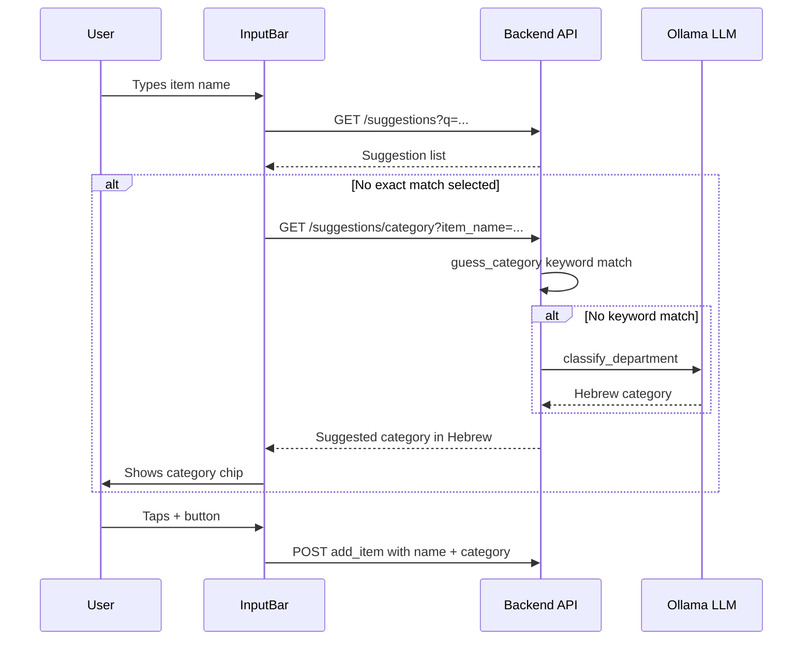
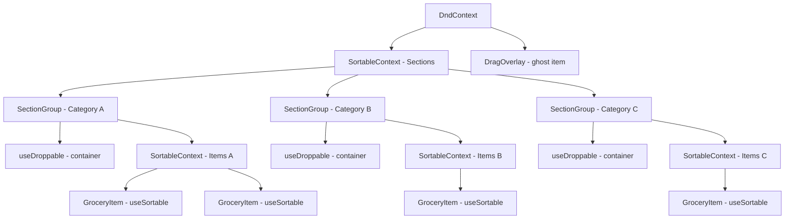

# UI Improvements Plan

## Overview
Three main improvements to the Hopper Shopper grocery list app:
1. **Category always in Hebrew** in the edit item modal
2. **LLM-based category suggestion** when adding a detailed item from the input bar
3. **Fix input bar clipping** at the bottom of the screen
4. **Drag-and-drop items** between categories and reorder within categories

---

## 1. Category Always in Hebrew in Edit Item Modal

### Current Behavior
In [`ItemDetailModal.tsx`](frontend/src/components/ItemDetailModal.tsx:35), the `handleSelectDepartment` function checks if the current category text looks Hebrew and picks the language accordingly. This means if the user types in English, they get an English category name.

### Desired Behavior
When selecting a department from the dropdown, **always use the Hebrew name** (`dept.name_he`). The category field should always store and display Hebrew department names.

### Changes Required

**File: [`ItemDetailModal.tsx`](frontend/src/components/ItemDetailModal.tsx:35-42)**
- Modify `handleSelectDepartment` to always prefer `dept.name_he` over `dept.name`
- Change from:
  ```ts
  const isHebrew = /[\u0590-\u05FF]/.test(category);
  const selectedName = isHebrew && dept.name_he ? dept.name_he : dept.name || dept.name_he || "";
  ```
- To:
  ```ts
  const selectedName = dept.name_he || dept.name || "";
  ```

**File: [`department.py`](backend/app/services/department.py:15-106)**
- No backend changes needed — the department search already returns both `name` and `name_he` fields. The frontend just needs to always pick `name_he`.

**File: [`grouping.py`](backend/app/services/grouping.py:358-383) — `guess_category_smart`**
- Modify to always return Hebrew category names regardless of input language
- When the keyword match returns an English category, translate it to Hebrew using `DEPT_EN_TO_HE`
- When the LLM returns an English department, translate it to Hebrew using `DEPT_EN_TO_HE`

**File: [`llm.py`](backend/app/services/llm.py:21-32)**
- Update the system prompt to always respond with the Hebrew department name, regardless of input language

---

## 2. LLM-Based Category Suggestion When Adding Items

### Current Behavior
When a user types in the [`InputBar`](frontend/src/components/InputBar.tsx:9), the [`useSuggestions`](frontend/src/hooks/useSuggestions.ts) hook searches the `ItemDictionary` and `GlobalItem` tables for matching items. If a suggestion is selected, its `default_category` is used. If no suggestion is selected, the backend's `guess_category_smart` assigns a category via keyword matching + LLM fallback.

### Desired Behavior
When the user types a detailed item name like "אבוקדו האס" and there is no exact match in suggestions, the app should call the LLM to suggest a category **before** the user submits. This way the user sees the suggested category and can confirm or change it.

### Changes Required

**Backend: New endpoint for category suggestion**

**File: [`suggestions.py`](backend/app/routers/suggestions.py) (router)**
- Add a new endpoint `GET /api/suggestions/category?item_name=...` that calls `guess_category_smart` and returns the suggested Hebrew category name

**File: [`grouping.py`](backend/app/services/grouping.py:358-383)**
- Already has `guess_category_smart` — just ensure it always returns Hebrew (see section 1)

**Frontend: Show suggested category in InputBar**

**File: [`api.ts`](frontend/src/services/api.ts)**
- Add new function `getCategorySuggestion(itemName: string): Promise<string | null>`

**File: [`InputBar.tsx`](frontend/src/components/InputBar.tsx)**
- After the user types a name and no suggestion is selected, debounce-call the new category suggestion endpoint
- Display the suggested category as a small chip/tag below the input
- Allow the user to dismiss or accept the suggestion
- When submitting, include the suggested category in the `addItem` payload

### Flow Diagram



---

## 3. Fix Input Bar Clipping at Bottom of Screen

### Current Behavior
The [`input-bar`](frontend/src/styles/telegram-theme.css:151-163) is `position: fixed; bottom: 0` with `padding: 8px 12px`. On some devices — especially Telegram Mini Apps with safe area insets — the bar and the `+` button get clipped by the bottom edge of the screen.

### Changes Required

**File: [`telegram-theme.css`](frontend/src/styles/telegram-theme.css:151-202)**
- Add `padding-bottom` that accounts for safe area insets using `env(safe-area-inset-bottom)`
- Increase the overall padding for better touch targets
- Make the `+` button larger (from 36px to 44px) for better tappability
- Increase the input height slightly
- Update the `.app-container` `padding-bottom` to match the new bar height
- Update `.suggestion-menu` `bottom` offset to match

```css
.input-bar {
  padding: 10px 12px calc(10px + env(safe-area-inset-bottom, 0px));
}

.input-bar .send-btn {
  width: 44px;
  height: 44px;
  font-size: 24px;
}

.input-bar input {
  padding: 12px 16px;
}
```

- Update `.app-container` padding-bottom from `80px` to `~100px`
- Update `.suggestion-menu` bottom from `60px` to `~76px`

---

## 4. Drag-and-Drop Items Between Categories and Reorder

### Current Behavior
The app uses `@dnd-kit` for drag-and-drop. Currently in [`GroceryList.tsx`](frontend/src/components/GroceryList.tsx:20), only **section groups** (categories) are sortable — you can reorder entire category sections. Individual items within sections are **not** draggable.

### Desired Behavior
- Individual items should be draggable **within** their category to reorder
- Individual items should be draggable **between** categories (changing their category)
- Category sections should remain reorderable as well

### Architecture

This requires upgrading from a simple `SortableContext` to a multi-container drag-and-drop setup using `@dnd-kit`'s collision detection and container concepts.

### Changes Required

**File: [`GroceryList.tsx`](frontend/src/components/GroceryList.tsx)**
- Implement multi-container DnD using `DndContext` with `DragOverlay`
- Track `activeId` state for the currently dragged item
- Use `closestCorners` or `rectIntersection` collision detection for cross-container drops
- Handle `onDragStart`, `onDragOver` (for cross-container movement), and `onDragEnd`
- When an item is dropped in a different category section, update its category via `updateItem`
- When an item is reordered within the same category, update sort order via `reorderItems`

**File: [`SectionGroup.tsx`](frontend/src/components/SectionGroup.tsx)**
- Add a `SortableContext` for items within each section using `verticalListSortingStrategy`
- Use `useDroppable` to make each section a drop target for cross-category moves
- Keep the section header draggable for section reordering

**File: [`GroceryItem.tsx`](frontend/src/components/GroceryItem.tsx)**
- Wrap each item with `useSortable` to make it draggable
- Add a drag handle or make the entire row draggable with a long-press activation
- Apply transform/transition styles during drag

**File: [`useListStore.ts`](frontend/src/stores/useListStore.ts)**
- Add a `moveItemToCategory(itemId: number, newCategory: string)` action that calls `updateItem` with the new category
- The existing `reorderItems` handles sort order changes

**File: [`telegram-theme.css`](frontend/src/styles/telegram-theme.css)**
- Add styles for drag overlay (the ghost item shown while dragging)
- Add visual feedback for drop targets (highlight category section when hovering)
- Style the drag handle on items

**File: [`types.ts`](frontend/src/types.ts:76-81)**
- Add `move_item` to `WSAction` type if we want real-time sync of category changes (optional — `update_item` already covers this)

### DnD Architecture Diagram



### Drag Scenarios

| Scenario | Detection | Action |
|----------|-----------|--------|
| Item reorder within same category | `active.containerId === over.containerId` | Call `reorderItems` with new order |
| Item moved to different category | `active.containerId !== over.containerId` | Call `updateItem` with new category + `reorderItems` |
| Section reorder | Both `active` and `over` are section IDs | Call `reorderItems` with section-level reorder |

---

## Implementation Order

1. **Fix input bar clipping** — CSS-only change, quick win
2. **Category always in Hebrew** — Small changes in frontend + backend
3. **LLM category suggestion** — New endpoint + InputBar UI enhancement
4. **Drag-and-drop items** — Most complex, requires significant DnD refactoring

---

## Files to Modify Summary

| File | Changes |
|------|---------|
| [`telegram-theme.css`](frontend/src/styles/telegram-theme.css) | Input bar sizing, safe area, drag styles |
| [`ItemDetailModal.tsx`](frontend/src/components/ItemDetailModal.tsx) | Always use Hebrew category |
| [`grouping.py`](backend/app/services/grouping.py) | Always return Hebrew categories |
| [`llm.py`](backend/app/services/llm.py) | Always respond in Hebrew |
| [`suggestions.py`](backend/app/routers/suggestions.py) | New category suggestion endpoint |
| [`api.ts`](frontend/src/services/api.ts) | New API function for category suggestion |
| [`InputBar.tsx`](frontend/src/components/InputBar.tsx) | Category suggestion chip UI |
| [`GroceryList.tsx`](frontend/src/components/GroceryList.tsx) | Multi-container DnD |
| [`SectionGroup.tsx`](frontend/src/components/SectionGroup.tsx) | Item-level sortable + droppable |
| [`GroceryItem.tsx`](frontend/src/components/GroceryItem.tsx) | Make items draggable |
| [`useListStore.ts`](frontend/src/stores/useListStore.ts) | moveItemToCategory action |
