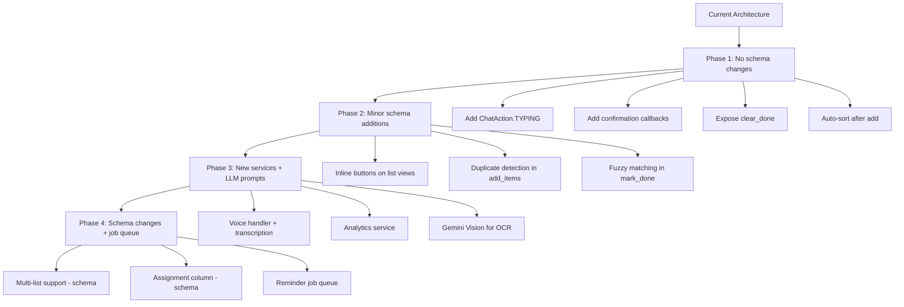

# 🛒 Hopper Shopper — UX Improvements Plan

## Executive Summary

After a thorough review of the Hopper Shopper codebase, I've identified improvements across three categories: **UX friction points**, **ease-of-use enhancements**, and **wow-effect features**. The bot has a solid foundation — Hebrew-first NLU, LLM-powered parsing, department sorting, and interactive shopping mode — but there are significant opportunities to make it feel more polished, delightful, and sticky for daily use.

---

## Current State Assessment

### What Works Well ✅
- Smart NLU pipeline (intent understanding → smart parsing → regex fallback)
- Department classification with LLM fallback
- Interactive shopping mode with inline buttons
- Item history with auto-applied details/brands
- Resilient architecture (circuit breakers, retry logic, rate limiting)

### Key UX Gaps 🔍
1. **No confirmation before destructive actions** — `/clear` wipes everything instantly
2. **No undo capability** — accidental deletions are permanent
3. **Shopping mode loses keyboard on completion** — no way to restart or share summary
4. **No progress feedback** — users don't know the bot is "thinking" during LLM calls
5. **Flat inline suggestions** — no visual hierarchy or frequency indicators
6. **No multi-list support** — families often shop at multiple stores
7. **No sharing/forwarding** — can't easily send the list to someone not in the group
8. **No recurring items** — users re-add the same items every week
9. **Silent failures on NLU miss** — bot ignores messages it doesn't understand with no feedback
10. **No onboarding flow** — `/start` is a wall of text with no guided first experience

---

## Improvement Categories

### 🟢 Category A: Quick UX Wins (Low effort, high impact)

#### A1. Typing Indicator During LLM Calls
**Problem:** When the bot calls the LLM for intent understanding or smart parsing, there's no visual feedback. Users think the bot is broken.

**Solution:** Send `ChatAction.TYPING` before any LLM call. Telegram shows "Bot is typing..." in the chat header.

**Files:** [`handle_text_message()`](bot/handlers/messages.py:258), [`sort_command()`](bot/handlers/commands.py:297)

---

#### A2. Confirmation Dialog for `/clear`
**Problem:** `/clear` instantly deletes all items with no way to undo. In a group chat, one person can accidentally wipe everyone's list.

**Solution:** Reply with an inline keyboard: "🗑️ למחוק X פריטים? [כן ❌] [לא ↩️]". Only execute on confirmation. Auto-expire after 30 seconds.

**Files:** [`clear_command()`](bot/handlers/commands.py:183), [`handle_shop_callback()`](bot/handlers/callbacks.py:74)

---

#### A3. Auto-Show Sorted List After Adding Items
**Problem:** After auto-detecting a grocery list, the bot says "שלחו /sort למיון לפי מחלקות 🏪" — forcing an extra step. Since items are already classified during `add_items()`, the sorted view is free.

**Solution:** After adding 3+ items via auto-detection, automatically show the sorted list instead of prompting for `/sort`. Add an inline button "🔄 מיין מחדש" for re-sorting.

**Files:** [`handle_text_message()`](bot/handlers/messages.py:319), [`_handle_add_action()`](bot/handlers/messages.py:82)

---

#### A4. Richer Shopping Completion Message
**Problem:** When all items are checked off in shopping mode, the message just says "🎉 סיימתם את הקניות! ✅ כל הפריטים נקנו!" — no summary, no next action.

**Solution:** Show a completion summary with total items, time spent shopping (from first toggle to last), and action buttons: [🗑️ נקה רשימה] [📋 רשימה חדשה] [📊 סיכום מחירים].

**Files:** [`handle_shop_callback()`](bot/handlers/callbacks.py:140)

---

#### A5. Pinned List Message
**Problem:** In active group chats, the grocery list message gets buried under other conversations.

**Solution:** After `/sort` or `/shop`, offer to pin the message. Add a "📌 הצמד" inline button. The bot pins the message (requires admin permissions in the group).

**Files:** [`sort_command()`](bot/handlers/commands.py:297), [`shop_command()`](bot/handlers/callbacks.py:25)

---

#### A6. Empty State with Quick-Add Suggestions
**Problem:** When the list is empty, the bot just says "📝 הרשימה ריקה!" — a dead end.

**Solution:** Show the empty state with the user's most frequently added items from history as quick-add inline buttons: "📝 הרשימה ריקה!\n\nפריטים שאתם בדרך כלל קונים:\n[+ חלב] [+ ביצים] [+ לחם]"

**Files:** [`list_command()`](bot/handlers/commands.py:274), [`format_plain_list()`](bot/services/formatter.py:126)

---

### 🟡 Category B: Ease-of-Use Enhancements (Medium effort)

#### B1. Quick-Add Buttons on Every List View
**Problem:** After viewing the list (`/list` or `/sort`), users must type a new command to add items. No inline interaction.

**Solution:** Add inline buttons below every list view:
- [➕ הוסף פריטים] — triggers a "reply to this message with items" flow
- [🛍️ מצב קניות] — shortcut to `/shop`
- [🗑️ נקה נקנו] — clear only done items (new feature)

**Files:** [`list_command()`](bot/handlers/commands.py:274), [`sort_command()`](bot/handlers/commands.py:297), [`format_sorted_list()`](bot/services/formatter.py:30)

---

#### B2. "Clear Done Items" Action
**Problem:** `/clear` is all-or-nothing. After shopping, users want to keep un-purchased items but remove the checked-off ones.

**Solution:** Add `/cleardone` command and an inline button. The `clear_list()` function already supports `done_only=True` but it's never exposed to users.

**Files:** [`clear_list()`](bot/services/list_manager.py:346) — already implemented! Just needs a handler.

---

#### B3. Edit Item Quantity/Brand Inline
**Problem:** To change quantity or brand, users must remove and re-add the item. No edit flow.

**Solution:** In shopping mode, long-press (or a ✏️ button next to each item) opens a mini-edit flow: "✏️ עריכת חלב\nכמות נוכחית: 1 ליטר\nשלחו כמות חדשה או /cancel". Use `ConversationHandler` for the edit flow.

**Files:** New handler needed, [`GroceryItem`](bot/models/grocery_item.py:11) model already supports all fields.

---

#### B4. Smart Duplicate Detection
**Problem:** Adding "חלב" when "חלב" is already on the list creates a duplicate. No warning.

**Solution:** Before adding, check for existing items. If found, ask: "חלב כבר ברשימה. [הוסף בכל זאת] [עדכן כמות] [דלג]". For auto-detected lists, silently skip duplicates and mention them: "✅ 5 פריטים נוספו (חלב כבר ברשימה, דילגתי)".

**Files:** [`add_items()`](bot/services/list_manager.py:141), [`add_items_structured()`](bot/services/list_manager.py:198)

---

#### B5. Natural Language Price Input
**Problem:** `/price חלב 7.90` is rigid. Users naturally say "החלב עלה 7.90" or "שילמתי 25 על הבשר".

**Solution:** Extend the LLM intent system to recognize price-setting intents. Add a "price" action to [`_INTENT_SYSTEM`](bot/services/llm.py:720) prompt.

**Files:** [`_INTENT_SYSTEM`](bot/services/llm.py:720), [`handle_text_message()`](bot/handlers/messages.py:258)

---

#### B6. Improved Onboarding Flow
**Problem:** `/start` dumps a text wall. New users in a group don't know what the bot can do.

**Solution:** Multi-step onboarding with inline buttons:
1. Welcome message with bot avatar and 3 key features
2. "🚀 נתחיל! שלחו רשימת קניות ראשונה" with example
3. After first list is added, show a "💡 טיפ: שלחו /shop למצב קניות אינטראקטיבי"
4. Track onboarding state per user to avoid repeating

**Files:** [`start_command()`](bot/handlers/commands.py:80), new onboarding state in [`User`](bot/models/user.py:11) model

---

#### B7. Fuzzy Item Matching
**Problem:** `/done חלב תנובה` won't match if the item is stored as "חלב". Exact matching is brittle for Hebrew with its morphological variations.

**Solution:** Use fuzzy matching (Levenshtein distance or substring containment) when exact match fails. "Did you mean X?" with inline buttons for ambiguous matches.

**Files:** [`mark_item_done()`](bot/services/list_manager.py:303), [`remove_items()`](bot/services/list_manager.py:271)

---

### 🔴 Category C: Wow-Effect Features (Higher effort, high delight)

#### C1. Weekly Shopping Summary & Insights
**Problem:** No analytics or insights. Users shop every week but learn nothing from their patterns.

**Solution:** Weekly digest (configurable day/time via `/settings`):
- "📊 סיכום שבועי: קניתם 23 פריטים ב-₪187.50"
- Most bought items this month
- Price trends ("🔺 חלב עלה ב-8% מהחודש שעבר")
- Streak: "🔥 3 שבועות רצופים של קניות!"

**Files:** New service `bot/services/analytics.py`, scheduled job via `Application.job_queue`

---

#### C2. Recipe-to-List Integration
**Problem:** Users manually type ingredients. No way to import from a recipe.

**Solution:** Users send a recipe URL or text, and the LLM extracts ingredients and adds them to the list. "🍳 שלחו קישור למתכון ואוסיף את המצרכים לרשימה!" Support popular Israeli recipe sites (מאקו, פודיש, אל השולחן).

**Files:** New handler in [`messages.py`](bot/handlers/messages.py), new LLM prompt in [`llm.py`](bot/services/llm.py)

---

#### C3. Photo-to-List (OCR)
**Problem:** Users sometimes have a handwritten list or a screenshot they want to digitize.

**Solution:** Accept photos and use Gemini's vision capabilities to extract grocery items. "📸 שלחו תמונה של רשימת קניות ואמיר אותה לרשימה דיגיטלית!"

**Files:** New photo handler in [`messages.py`](bot/handlers/messages.py), Gemini vision API call in [`llm.py`](bot/services/llm.py)

---

#### C4. Collaborative Assignments
**Problem:** In family/roommate groups, there's no way to assign items to specific people.

**Solution:** `/assign חלב @username` — assigns an item to a person. In shopping mode, show who's responsible: "☐ חלב (👤 דני)". Filter view: `/myitems` shows only your assigned items.

**Files:** New `assigned_to` column on [`GroceryItem`](bot/models/grocery_item.py:11), new handlers

---

#### C5. Store-Specific Lists & Aisle Mapping
**Problem:** One flat list for all stores. Families often split shopping between stores (Rami Levy for bulk, local makolet for fresh).

**Solution:** Support multiple named lists: `/newlist רמי לוי`, `/switch מכולת`. Each list has its own items. `/lists` shows all active lists. Default list is "רשימת קניות".

**Files:** Modify [`GroceryList`](bot/models/grocery_list.py:11) model (remove unique active constraint per chat, add selection state), new commands

---

#### C6. Voice Message Support
**Problem:** Users can't add items by voice. In Israel, voice messages are extremely popular on Telegram/WhatsApp.

**Solution:** Accept voice messages, transcribe using Gemini or Whisper, then parse as a grocery list. "🎤 שלחו הודעה קולית ואוסיף את הפריטים!"

**Files:** New voice handler in [`messages.py`](bot/handlers/messages.py), transcription in [`llm.py`](bot/services/llm.py)

---

#### C7. Smart Reminders
**Problem:** No proactive engagement. The bot is purely reactive.

**Solution:** 
- "🔔 יש לכם 5 פריטים ברשימה. זמן לקניות?" — configurable reminder
- "📝 בדרך כלל אתם קונים חלב כל שבוע. להוסיף?" — predictive suggestions based on purchase frequency
- Location-based (if user shares location near a supermarket): "📍 אתם ליד רמי לוי! יש לכם 8 פריטים ברשימה"

**Files:** New service `bot/services/reminders.py`, `Application.job_queue` for scheduling

---

## Implementation Priority Matrix

```
                    HIGH IMPACT
                        │
         C1 C6    A3 A4 │ A1 A2 A6
         C2 C7    B1 B4 │ B2
                        │
  HIGH EFFORT ──────────┼────────── LOW EFFORT
                        │
         C4 C5    B3    │ A5
         C3       B5 B6 │ B7
                        │
                    LOW IMPACT
```

## Recommended Implementation Order

### Phase 1 — Polish & Quick Wins ✅
1. ~~**A1** — Typing indicator during LLM calls~~
2. ~~**A2** — Confirmation dialog for `/clear`~~
3. ~~**A6** — Empty state with quick-add suggestions from history~~
4. ~~**B2** — Expose "clear done items" (already implemented in backend!)~~
5. ~~**A3** — Auto-show sorted list after adding items~~

### Phase 2 — Interaction Depth ✅
6. ~~**A4** — Richer shopping completion message~~
7. ~~**B1** — Quick-add buttons on every list view~~
8. ~~**B4** — Smart duplicate detection~~
9. ~~**A5** — Pinned list message~~
10. ~~**B7** — Fuzzy item matching~~

### Phase 3 — Delight & Stickiness
11. **B6** — Improved onboarding flow
12. **B5** — Natural language price input
13. **C6** — Voice message support
14. **C1** — Weekly shopping summary & insights
15. **C3** — Photo-to-list (OCR via Gemini Vision)

### Phase 4 — Power Features
16. **C2** — Recipe-to-list integration
17. **B3** — Edit item quantity/brand inline
18. **C5** — Store-specific lists
19. **C4** — Collaborative assignments
20. **C7** — Smart reminders

---

## Architecture Impact



---

## Key Technical Notes

1. **Callback data size limit:** Telegram limits callback_data to 64 bytes. Current shopping mode uses `shop:toggle:{id}` which is fine, but new features must stay within this limit. Consider using short prefixes like `c:` for clear confirmation, `qa:{id}` for quick-add.

2. **Message edit rate limit:** Telegram limits message edits to ~30/minute per chat. Shopping mode already handles `BadRequest` for "not modified" — new features should follow the same pattern.

3. **Group permissions:** Pinning messages requires the bot to be a group admin. The bot should gracefully handle `ChatAdminRequired` errors.

4. **`clear_list(done_only=True)`** is already implemented in [`clear_list()`](bot/services/list_manager.py:346) but never exposed — this is the lowest-hanging fruit in the entire plan.

5. **Voice messages:** Telegram provides `.ogg` files. Gemini can process audio directly, or use `pydub` to convert to WAV for Whisper.
