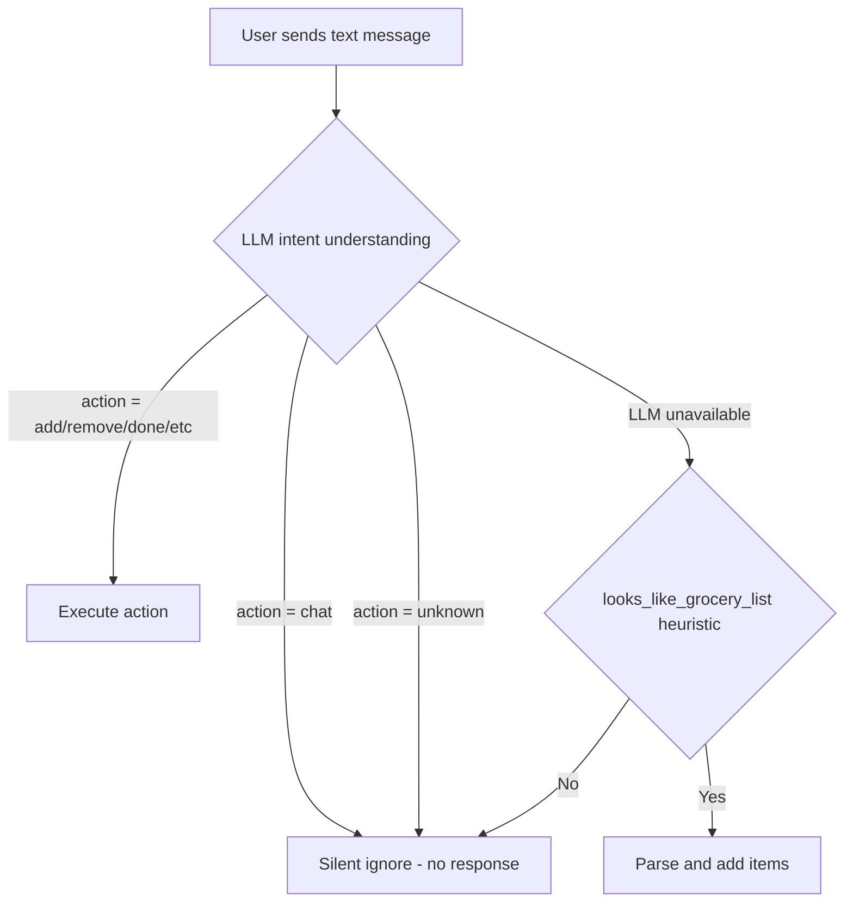
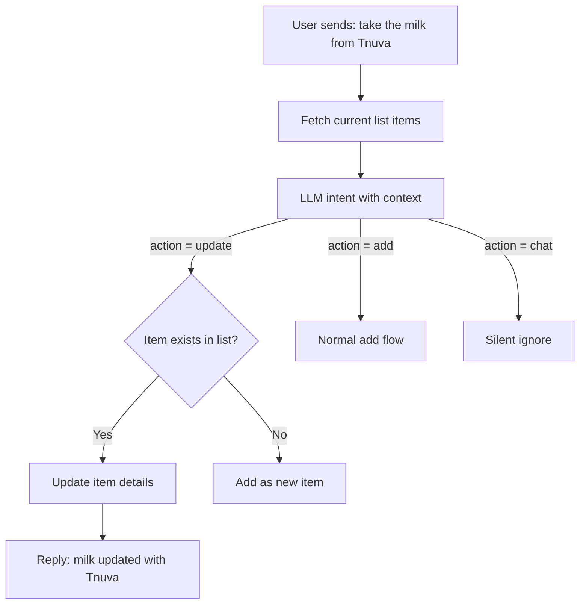

# UX Improvements v2 — Intent Recognition, Item References & Detail View

## Summary

Three improvements to the Hopper Shopper Telegram bot:

1. **Better intent recognition** — Stop treating regular chat messages as grocery items
2. **Item reference detection** — Recognize when a message refers to an existing list item and update it
3. **Easy item details** — Add an ℹ️ button in shopping mode to view/enrich item details

---

## 1. Improve Intent Recognition

### Problem

The current LLM intent prompt in [`_INTENT_SYSTEM`](bot/services/llm.py:720) explicitly biases toward `add`:

> "אם יש ספק, העדף add על unknown"

This causes regular conversational messages like "אני בדרך", "מה קורה?", "תודה!" to be misinterpreted as grocery add requests. The [`handle_text_message()`](bot/handlers/messages.py:303) function acts on any non-`unknown` intent, so false positives trigger unwanted actions.

### Solution

#### A. Update the LLM intent prompt (`bot/services/llm.py`)

- Add a `"chat"` intent for regular conversational messages
- Remove the bias toward `add` — replace with: "if the message is clearly conversational or not related to a grocery list, use `chat`"
- Add examples of chat messages in both Hebrew and English:
  - "אני בדרך" → `{"action": "chat", "items": []}`
  - "תודה רבה" → `{"action": "chat", "items": []}`
  - "מה קורה?" → `{"action": "chat", "items": []}`
  - "ok" → `{"action": "chat", "items": []}`
  - "👍" → `{"action": "chat", "items": []}`
  - "אני אגיע בעוד 10 דקות" → `{"action": "chat", "items": []}`
- Keep `add` as the intent only when items are explicitly mentioned in a grocery context

#### B. Update valid actions set (`bot/services/llm.py`)

- Add `"chat"` to [`valid_actions`](bot/services/llm.py:781): `{"add", "remove", "done", "list", "sort", "clear", "help", "unknown", "chat"}`

#### C. Update message handler (`bot/handlers/messages.py`)

- In [`handle_text_message()`](bot/handlers/messages.py:303), treat `"chat"` the same as `"unknown"` — silently ignore (no response)
- Update the condition at line 326: `if intent and intent["action"] not in ("unknown", "chat"):`

#### D. Update the heuristic fallback (`bot/services/parser.py`)

- In [`looks_like_grocery_list()`](bot/services/parser.py:58), add additional filters:
  - Skip messages that are very short single words that look conversational (e.g., "ok", "תודה", "בסדר")
  - Skip messages with emoji-only content

### Flow After Change



---

## 2. Identify References to Existing List Items

### Problem

When a user says "קח את החלב של תנובה" and "חלב" is already in the list, the bot currently either:
- Tries to add "חלב של תנובה" as a new item (duplicate detected, skipped)
- Or treats it as an unknown intent

The bot should recognize this as a reference to an existing item and update its details.

### Solution

#### A. Add `"update"` intent to the LLM prompt (`bot/services/llm.py`)

- Add `"update"` to the intent system prompt with examples:
  - "קח את החלב של תנובה" → `{"action": "update", "items": [{"name": "חלב", "detail": "תנובה"}]}`
  - "העגבניות צריכות להיות שרי" → `{"action": "update", "items": [{"name": "עגבניות", "detail": "שרי"}]}`
  - "קח 2 קילו תפוחים" → `{"action": "update", "items": [{"name": "תפוחים", "quantity": "2", "unit": "קילו"}]}`
- Update the items format for `update` to include optional `detail`, `quantity`, `unit`, `brand` fields
- Add `"update"` to [`valid_actions`](bot/services/llm.py:781)

#### B. Create a new `understand_intent_with_context()` function (`bot/services/llm.py`)

- Accepts the user's text AND the current list of item names
- Injects the current list items into the prompt so the LLM can match references:
  ```
  הפריטים הנוכחיים ברשימה: חלב, לחם, ביצים, עגבניות
  ```
- This allows the LLM to recognize "קח את החלב של תנובה" as referring to the existing "חלב" item
- Falls back to [`understand_intent()`](bot/services/llm.py:748) if no list context is available

#### C. Add `_handle_update_action()` in `bot/handlers/messages.py`

- Receives the update intent with item references
- For each referenced item:
  1. Find the item in the current list using [`_fuzzy_find_items()`](bot/services/list_manager.py:462)
  2. Update its fields (brand, quantity, unit, description) based on what the LLM extracted
  3. Confirm the update to the user: "✏️ חלב עודכן: תנובה"
- If the item is NOT found in the list, fall back to adding it as a new item

#### D. Add `update_item_details()` in `bot/services/list_manager.py`

- New function that updates an existing `GroceryItem`'s fields:
  - `brand`, `quantity`, `unit`, `description`
- Also updates the `ItemHistory` default_detail for future adds
- Returns the updated item

#### E. Update message handler flow (`bot/handlers/messages.py`)

- In [`handle_text_message()`](bot/handlers/messages.py:303):
  1. Fetch current list items BEFORE calling intent understanding
  2. Pass item names to the new `understand_intent_with_context()` 
  3. Handle the `"update"` action by calling `_handle_update_action()`

### Flow After Change



---

## 3. Easy Item Details — ℹ️ Button in Shopping Mode

### Problem

Item details (brand, quantity, unit, description) are currently shown inline in the shopping keyboard button label, making buttons cluttered. There is no way to view or edit enriched details easily.

### Solution

#### A. Modify `_build_shopping_keyboard()` in `bot/handlers/callbacks.py`

- For each item, add a second button in the same row: an ℹ️ button
- The item row becomes two buttons side by side:
  - Left: `☐ חלב` (toggle done — existing behavior)
  - Right: `ℹ️` (view details)
- The ℹ️ button callback data: `shop:detail:{item_id}`
- Keep the main toggle button label clean — show only the item name (move quantity/brand to the detail view)

#### B. Add detail callback handler in `bot/handlers/callbacks.py`

- Handle `shop:detail:{item_id}` callback
- Query the full `GroceryItem` from the database
- Build a detail string with all available fields:
  ```
  📦 חלב
  
  🏷️ מותג: תנובה
  📏 כמות: 1 ליטר
  📝 פרטים: 3% שומן
  🏬 מחלקה: מוצרי חלב
  💰 מחיר: ₪7.90
  👤 נוסף ע"י: @username
  📅 נוסף: 29/03/2026
  ```
- Display using `query.answer(text, show_alert=True)` — this shows a modal popup in Telegram
- Note: `show_alert` text is limited to 200 characters, so format concisely
- If details exceed 200 chars, use `query.answer()` for a brief toast and send a separate message with full details

#### C. Register the new callback pattern in `bot/main.py`

- The existing `handle_shop_callback` already handles `shop:*` patterns
- The `shop:detail:` prefix just needs a new branch in [`handle_shop_callback()`](bot/handlers/callbacks.py:76) at the action routing level (line 94)

#### D. Simplify shopping button labels

- In [`_build_shopping_keyboard()`](bot/handlers/callbacks.py:356), simplify the main button label:
  - Before: `☐ חלב (1 ליטר) [תנובה]`
  - After: `☐ חלב` (with ℹ️ button for details)
- Only show a brief hint if quantity exists: `☐ חלב x2`

### Shopping Mode Layout After Change

```
── 🧀 מוצרי חלב ──
[☐ חלב          ] [ℹ️]
[☐ גבינה צהובה  ] [ℹ️]
[✅ יוגורט      ] [ℹ️]
── 🥬 ירקות ופירות ──
[☐ עגבניות x2   ] [ℹ️]
[☐ מלפפונים     ] [ℹ️]
```

---

## Files to Modify

| File | Changes |
|------|---------|
| [`bot/services/llm.py`](bot/services/llm.py) | Update `_INTENT_SYSTEM` prompt, add `chat`/`update` intents, add `understand_intent_with_context()`, update `valid_actions` |
| [`bot/handlers/messages.py`](bot/handlers/messages.py) | Handle `chat` and `update` intents, fetch list items before intent call, add `_handle_update_action()` |
| [`bot/services/parser.py`](bot/services/parser.py) | Improve `looks_like_grocery_list()` heuristic to filter conversational messages |
| [`bot/handlers/callbacks.py`](bot/handlers/callbacks.py) | Add ℹ️ button to shopping keyboard, add `shop:detail` handler, simplify button labels |
| [`bot/services/list_manager.py`](bot/services/list_manager.py) | Add `update_item_details()` function |
| [`bot/main.py`](bot/main.py) | No changes needed — `shop:detail` is handled by existing `handle_shop_callback` routing |

## No Database Migration Needed

All required fields (`brand`, `quantity`, `unit`, `description`, `price`, `added_by`, `created_at`) already exist on the [`GroceryItem`](bot/models/grocery_item.py:11) model.
